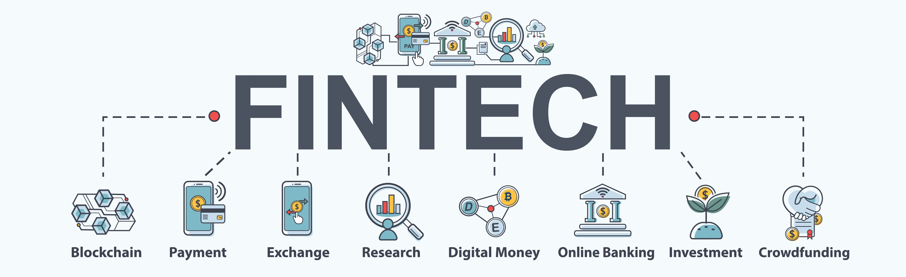
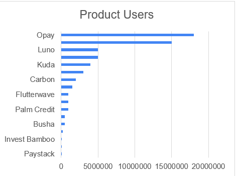
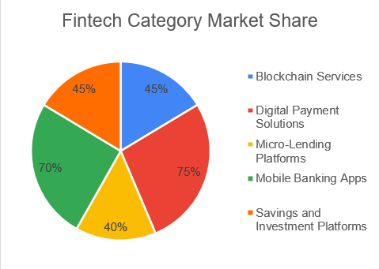
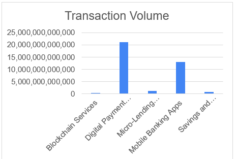
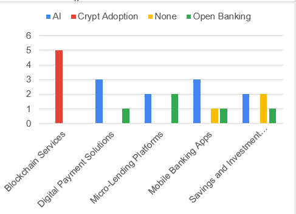
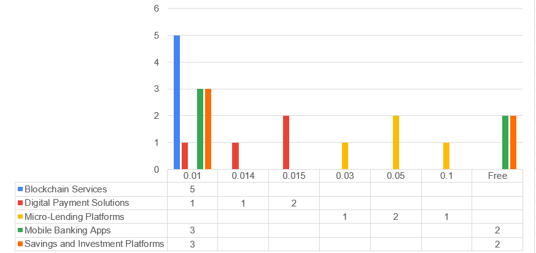
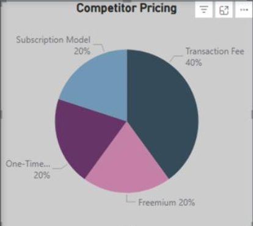
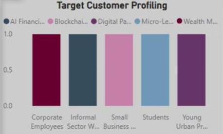
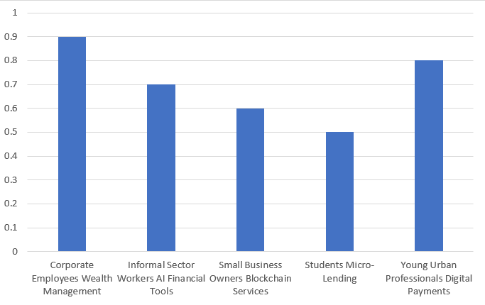
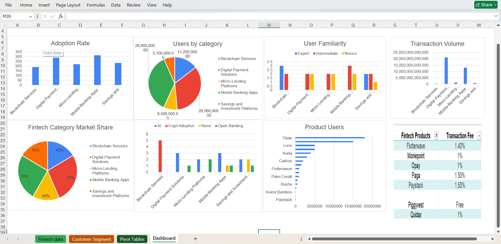

# Analysis of the Fintech Market Analysis in Nigeria

## Project Overview
This repository contains the data and documentation for a comprehensive Nigerian FinTech ecosystem market analysis. The project aims to provide insights into popular products, trends, competitor pricing, and customer profiles to guide strategic decisions for a FinTech startup. The analysis was conducted as part of a group project, emphasizing teamwork and collaboration.
## Project Objectives
-  1. The research seeks to answer the following questions:
   2. What are the most in-demand FinTech products in Nigeria?
   3. What are the latest trends in FinTech adoption (e.g., digital currencies, AI-driven tools, open banking)?
   4. How do competitors price their services, and where are the gaps?
   5. Who are the target customers, and what are their preferences?
   6. What are the key challenges and opportunities in the Nigerian FinTech market?
      
## Methodology
### Data Collection
The analysis used secondary data collected from industry reports, company websites, and news articles.
Sources include; 
-  the GSMA Mobile Economy Report, 
-  Disrupt Africa FinTech Report, 
-  Central Bank of Nigeria (CBN), 
-  National Bureau of Statistics (NBS)
-  Statista.
### Data Analysis
Excel and PowerBI were used to analyze numerical data (e.g., adoption rates, transaction volumes, pricing models) and to identify trends and customer preferences.
### Visualization
Visuals were created using Excel and Power BI.
Visualizations include bar charts, pie charts, and line charts.

## Key Findings
### 1. Popular Products
Digital Payment Solutions: Mobile money, QR payments, and peer-to-peer transfers (example OPay)

Mobile Banking Apps like Kuda Bank and ALAT by Wema Bank

 

Micro-lending platforms like Carbon offer quick loans.

 

### 2. Trends

Digital Currencies: The adoption of cryptocurrencies like Bitcoin and Ethereum is growing.
AI-Driven Tools: Chatbots and robo-advisors are being adopted to enhance customer service.
Open Banking: APIs are enabling third-party developers to build innovative financial apps.
### 3. Competitor Pricing

 
 Digital Payments offer free transactions for small payments and 1.5%-3% fees for larger transactions.
 Micro-lending offers interest rates between 3% and 15% per month and higher rates for short-term loans

40% of the competitors make use of transaction fees
For subscription-based banking services, premium accounts are charged between ₦500-₦2000/month, offering benefits like overdrafts and cashback.
#### Gaps in the Market
-  **Digital Payments:** While digital payments dominate the market, most competitors use transaction fees, which can be costly for frequent users. There is also limited adoption of subscription-based models in this segment
-  **Micro-Lending:** Many microlending platforms charge high interest rates (e.g., 10-30%) and processing fees, which can deter borrowers, especially students and small business owners.
-  **Blockchain Services:** Blockchain services are still niche, with limited adoption among small business owners and other key segments. Many competitors focus on cryptocurrency trading, leaving gaps in areas like secure transactions and supply chain management.
-  **AI Financial Tools:** Financial tools are underutilized, especially among informal sector workers who could benefit from budgeting and financial planning tools.
  
### 4. Customer Profile

Corporate employees prefer wealth management services. They are interested in long-term financial planning, investment opportunities, and retirement savings too.
The informal sector prefers AI financial tools. They need tools for budgeting, saving, and managing irregular income.

Small business owners are interested in secure transactions, supply chain tracking, and fraud prevention. 
Young Urban Professionals prefer mobile apps for banking and investment services
Low-income earners with limited financial literacy. They primarily use digital payment solutions for basic transactions like airtime purchases and bill payments

---

### Dashboard

# Recommendation
-  1. Prioritize digital payment solutions and mobile banking while expanding microlending and blockchain offerings.
   2. Introduce flat fees for remittances (e.g., ₦500 for transactions under ₦100,000.
   3. Implement tiered interest rates for microloans, rewarding repeat borrowers with lower rates.
   4. Offer freemium models for investment platforms with premium analytics as an add-on.
   5. Young urban professionals: Utilize social media influencers and targeted ads on platforms like Instagram and LinkedIn.
   6. Tech-Savvy Users: Conduct educational campaigns on secure cryptocurrency trading and DeFi opportunities. Partner with blockchain firms to enhance credibility and reach.
   7. Small Business Owners (Rural): Expand agent networks and use radio ads in local languages to promote micro-lending platforms. Provide financial literacy workshops on effective loan management.
# Challenges
Data Privacy: Limited access to customer data.
Data Quality: Inconsistent or outdated data from secondary sources.

# Contributors
-  Chinaemelum Ndidi-Chukwuka
-  Kudimfon Paul
-  Osita Emmanuel
-  Harrison Ebipre

